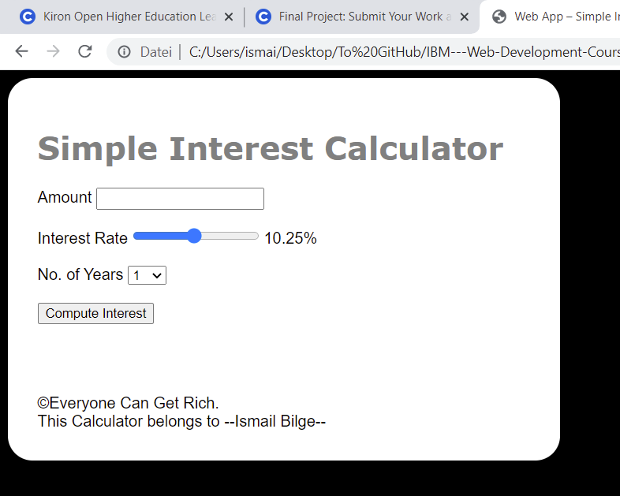

#  :computer: IBM---Web-Development-Course
> It is a course teaching how internet servers and clients work together to deliver applications to users, the context for application development in the Cloud, introducing front-end, back-end, and full-stack development, then focus on the languages for front-end development, working with HTML, CSS, and JavaScript.
> You can see the Certificate [link](https://www.coursera.org/account/accomplishments/verify/9YFTX69C8A46)

## Table of contents
  - [Table of contents](#table-of-contents)
  - [General info](#general-info)
  - [Week 1](#week-1)
  - [Week 2](#week-2)
  - [Week 3](#week-3)
  - [Week 4](#week-4)
  - [Final Week](#final-week)
  - [Screenshots](#screenshots)
  - [Contact](#contact)

## General info
Beginning with an explanation of how internet servers and clients work together to deliver applications to users, this course then takes you through the context for application development in the Cloud, introducing front-end, back-end, and full-stack development.

You’ll then focus on the languages you need for front-end development, working with HTML, CSS, and JavaScript.

Finally, you will discover tools that help you to store your projects and keep track of changes made to project files, such as Git and GitHub.

## Week 1
* Describe what developing a website or Cloud App involves.
* List some of the terminologies that web developers and Cloud App developers use.
* Classify the skills that Front-end, Back-end, and Full-stack developers need.
* Identify the tools that developers use to develop Cloud Apps.

## Week 2
* Discuss the history and objectives of HTML.
* Describe how HTML features enable you to build flexible and interactive websites.
* Explain the purpose of the HTML DOM Tree.
* Summarize how HTML uses APIs.
* Explain how scripting can be enabled in a browser to provide extended functionality.
* Outline how HTML is supported by common browsers.
* Describe how CSS is used to enhance websites.
* Create a simple webpage using HTML.
* Modify the appearance of HTML elements by using CSS.

## Week 3
* Identify the basic structural elements of HTML5.
* Describe the attributes of HTML5 input elements.
* Explain how to implement validation fallback.
* Group related elements together within an HTML form by using a fieldset element.
* Create an HTML5 form that includes input fields, controls, and a submit button.

## Week 4
* Describe the basic syntax of JavaScript.
* Explain how to work with variables in JavaScript.
* Describe how to control the flow of a JavaScript application with control statements.
* Outline the use of functions and prototypes in JavaScript.
* Explain the use of client-side JavaScript with HTML.
* Describe how JavaScript integrates with the document object model (DOM).
* List the common APIs used in JavaScript Applications.
* Validate user input on an HTML5 form by using JavaScript.
* Develop and run JavaScript on the browser console.
* Create and use variables, conditional statements, loops, and methods in JavaScript.

## Final Week
* Download code from a GitHub repository.
* Edit HTML to correct errors and add missing tags.
* Modify CSS to improve a web application’s look and feel.
* Write JavaScript code to implement a simple interest calculator.
* Test a web application to verify expected functionality.
* Evaluate the web applications created by your peers using the provided rubric and grading scheme.

## Screenshots

## Contact
:mailbox_with_mail: You can send me email : iismailbilge@gmail.com :mailbox_with_mail:

